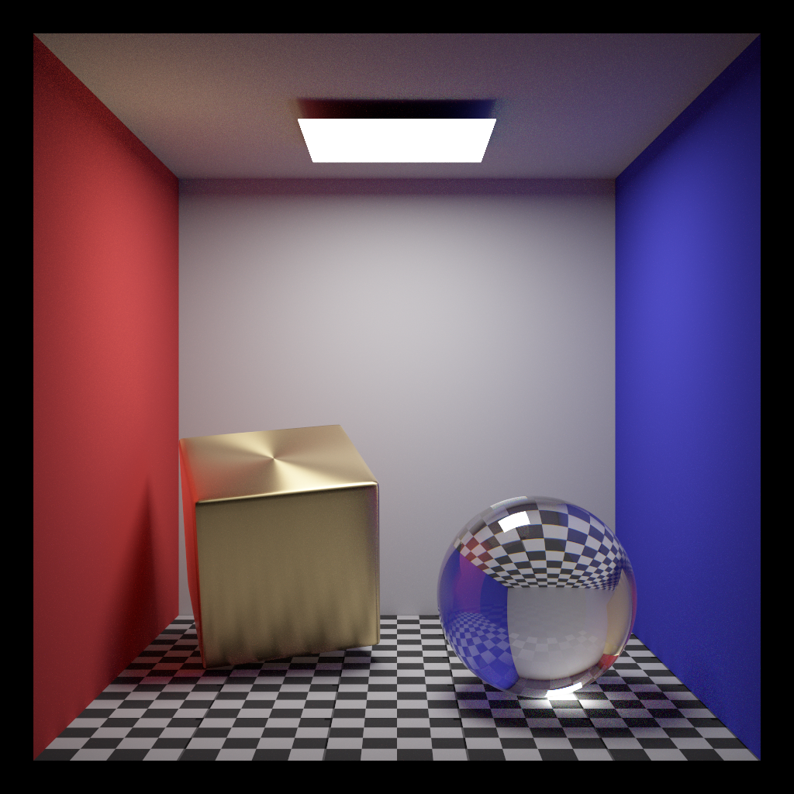
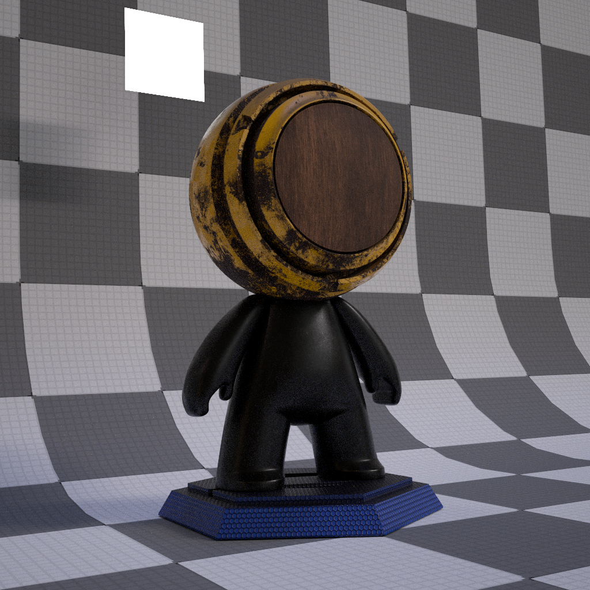

# VLR: 

  
IBL image: [sIBL Archive](http://www.hdrlabs.com/sibl/archive.html)  

VLRはNVIDIA OptiXを使用したGPUモンテカルロレイトレーシングレンダラーです。  
VLR is a GPU Monte Carlo ray tracing renderer using NVIDIA OptiX.

## 特徴 / Features
* GPU Renderer using NVIDIA OptiX
* Full Spectral Rendering (Monte Carlo Spectral Sampling)  
  (For RGB resources, RGB->Spectrum conversion is performed using Meng-Simon's method \[Meng2015\])
* RGB Rendering (built by default)
* BSDFs
    * Ideal Diffuse (Lambert) BRDF
    * Ideal Specular BRDF/BSDF
    * Microfacet (GGX) BRDF/BSDF
    * Fresnel-blended Lambertian BSDF
    * UE4- or Frostbite-like BRDF \[Karis2013, Lagarde2014\]
    * Mixed BSDF
* Shader Node System
* Bump Mapping (Normal Map)
* Light Source Types
    * Area (Polygonal) Light
    * Infinitely Distant Image Based Environmental Light
* Camera Types
    * Perspective Camera with Depth of Field (thin-lens model)
    * Environment (Equirectangular) Camera
* Geometry Instancing
* Light Transport Algorithms
    * Path Tracing \[Kajiya1986\] with MIS
* Correct handling of non-symmetric scattering due to shading normals \[Veach1996, 1997\]

## TODO
- [ ] Scene Editor
- [ ] Compile shader node at runtime using NVRTC to remove overhead of callable shaders.

## 動作環境 / Confirmed Environment
現状以下の環境で動作を確認しています。  
I've confirmed that the program runs correctly on the following environment.

* Windows 10 (1809) & Visual Studio 2017 (15.9.8)
* Core i9-9900K, 32GB, RTX 2070 8GB

動作させるにあたっては以下のライブラリが必要です。  
It requires the following libraries.

* CUDA 10.1
* OptiX 6.0 (requires Maxwell or later generation NVIDIA GPU)
* OpenEXR 2.2
* assimp 4.1

### Q&A
Q. Program crashes or produces a wierd image. What's going on?  
A. First try to launch the program with --logging option and check if it reports stack overflow error. If it does, try the --stacksize option (e.g. --stacksize 3072). You will see the stack size actually used at the early phase of standard output.

## 注意 / Note
モデルデータやテクスチャーを読み込むシーンファイルがありますが、それらアセットはリポジトリには含まれていません。

There are some scene files loading model data and textures, but those assets are NOT included in this repository.

## 参考文献 / References
[Kajiya1986] "THE RENDERING EQUATION"  
[Karis2013] "Real Shading in Unreal Engine 4"  
[Lagarde2014] "Moving Frostbite to Physically Based Rendering 3.0"  
[Veach1996] "Non-symmetric Scattering in Light Transport Algorithms"  

## ギャラリー / Gallery

A variant of the famous Cornell box scene. The left box has anisotropic BRDF with circular tangents along its local Y axis.

An object with UE4- or Frostbite 3.0-like BRDF (Textures are exported from Substance Painter) illuminated by an area light and an environmental light.  

Model: Substance Painter  
IBL image: [sIBL Archive](http://www.hdrlabs.com/sibl/archive.html)  

----
2019 [@Shocker_0x15](https://twitter.com/Shocker_0x15)
