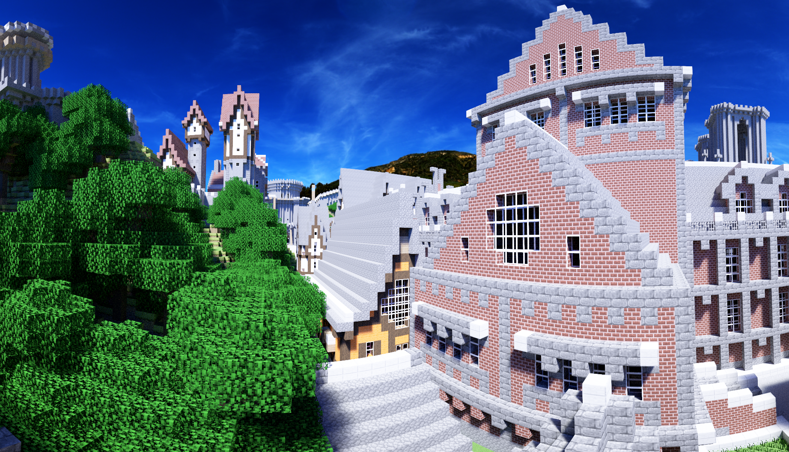

# VLR: 

\
IBL image: [sIBL Archive](http://www.hdrlabs.com/sibl/archive.html)

VLRはNVIDIA OptiXを使用したGPUモンテカルロレイトレーシングレンダラーです。\
VLR is a GPU Monte Carlo ray tracing renderer using NVIDIA OptiX.

## 特徴 / Features
* GPU Renderer using NVIDIA OptiX
* Full Spectral Rendering (Monte Carlo Spectral Sampling)\
  (For RGB resources, RGB->Spectrum conversion is performed using Meng-Simon's method \[Meng2015\])
* RGB Rendering (built by default)
* BSDFs
    * Ideal Diffuse (Lambert) BRDF
    * Ideal Specular BRDF/BSDF
    * Microfacet (GGX) BRDF/BSDF
    * Fresnel-blended Lambertian BSDF
    * UE4- or Frostbite-like BRDF \[Karis2013, Lagarde2014\]\
      Parameters can be specified using UE4 style (base color, roughness/metallic) or old style (diffuse, specular, glossiness).
    * Mixed BSDF
* Shader Node System
* Bump Mapping (Normal Map / Height Map)
* Alpha Texture
* Light Source Types
    * Area (Polygonal) Light
    * Infinitely Distant Image Based Environmental Light
* Camera Types
    * Perspective Camera with Depth of Field (thin-lens model)
    * Environment (Equirectangular) Camera
* Geometry Instancing
* Light Transport Algorithms
    * Path Tracing \[Kajiya1986\] with MIS
* Correct handling of non-symmetric scattering due to shading normals \[Veach1996, 1997\]

## 構成要素 / Components
* libVLR - Renderer Library based on OptiX\
  CのAPIを定義しています。\
  Exposes C API.
* VLRCpp.h - Single file wrapper for C++\
  std::shared_ptrを用いてオブジェクトの寿命管理を自動化しています。\
  Automatically manages lifetime of objects via std::shared_ptr.
* HostProgram - A program to demonstrate how to use VLR

## API
Code Example using VLRCpp (C++ wrapper)

```cpp
using namespace VLRCpp;

ContextRef context = Context::create(enableLogging);

SceneRef scene = context->createScene();

TriangleMeshSurfaceNodeRef cornellBox = context->createTriangleMeshSurfaceNode("Cornell Box");
{
    // ...
    cornellBox->setVertices(vertices, numVertices);
    // ...

    {
        Image2DRef image = loadImage2D(context, "checkerboard.png", 
                                       VLRSpectrumType_Reflectance, VLRColorSpace_Rec709_D65_sRGBGamma);

        ShaderNodeRef nodeAlbedo = context->createShaderNode("Image2DTexture");
        nodeAlbedo->set("image", image);
        nodeAlbedo->set("min filter", "Nearest");
        nodeAlbedo->set("mag filter", "Nearest");

        SurfaceMaterialRef mat = context->createSurfaceMaterial("Matte");
        mat->set("albedo", nodeAlbedo->getPlug(VLRShaderNodePlugType_Spectrum, 0));

        std::vector<uint32_t> matGroup = {
            0, 1, 2, 0, 2, 3
        };
        cornellBox->addMaterialGroup(matGroup.data(), matGroup.size(), mat, 
                                     ShaderNodePlug(), ShaderNodePlug(), 
                                     VLRTangentType_TC0Direction);
    }

    {
        // ...
    }

    // ...
}

InternalNodeRef transformNode = context->createInternalNode("trf A");
transformNode->setTransform(context->createStaticTransform(scale(2.0f)));
transformNode->addChild(cornellBox);
scene->addChild(transformNode);

CameraRef camera = context->createCamera("Perspective");
camera->set("position", Point3D(0, 1.5f, 6.0f));
camera->set("aspect", (float)renderTargetSizeX / renderTargetSizeY);
camera->set("sensitivity", 1.0f);
camera->set("fovy", 40 * M_PI / 180);
camera->set("lens radius", 0.0f);

context->bindOutputBuffer(1024, 1024, 0);

context->render(scene, camera, 1, firstFrame, &numAccumFrames);
```

## TODO
- [ ] Efficient Sampling from Many Lights
- [ ] Scene Editor
- [ ] Compile shader node at runtime using NVRTC to remove overhead of callable programs.

## 動作環境 / Confirmed Environment
現状以下の環境で動作を確認しています。\
I've confirmed that the program runs correctly on the following environment.

* Windows 10 (1903) & Visual Studio 2019 (16.1.3)
* Core i9-9900K, 32GB, RTX 2070 8GB
* NVIDIA Driver 430.64

動作させるにあたっては以下のライブラリが必要です。\
It requires the following libraries.

* libVLR
    * CUDA 10.1 Update 1
    * OptiX 6.0 (requires Maxwell or later generation NVIDIA GPU)
* Host Program
    * OpenEXR 2.2
    * assimp 4.1

### Q&A
Q. Program crashes or produces a wierd image. What's going on?\
A. First try to launch the program with --logging option and check if it reports stack overflow error. If it does, try the --maxcallabledepth option (e.g. --maxcallabledepth 8) on RTX-enabled environment, the --stacksize option (e.g. --stacksize 3072) on non-RTX environment. You will see the stack size actually used at the early phase of standard output in the non-RTX case.

## 注意 / Note
モデルデータやテクスチャーを読み込むシーンファイルがありますが、それらアセットはリポジトリには含まれていません。\
There are some scene files loading model data and textures, but those assets are NOT included in this repository.

## 参考文献 / References
[Kajiya1986] "THE RENDERING EQUATION"\
[Karis2013] "Real Shading in Unreal Engine 4"\
[Lagarde2014] "Moving Frostbite to Physically Based Rendering 3.0"\
[Veach1996] "Non-symmetric Scattering in Light Transport Algorithms"

## ギャラリー / Gallery
<br>
A variant of the famous Cornell box scene. The left box has anisotropic BRDF with circular tangents along its local Y axis (roughness is smoother along tangent, rougher along bitangent).
<br><br>
<br>
An object with UE4- or Frostbite 3.0-like BRDF (Textures are exported from Substance Painter) illuminated by an area light and an environmental light.

Model: Substance Painter\
IBL image: [sIBL Archive](http://www.hdrlabs.com/sibl/archive.html)
<br><br>
<br>
<br>
Rungholt model illuminated by outdoor environment light.

Model: Rungholt from Morgan McGuire's [Computer Graphics Archive](https://casual-effects.com/data)\
IBL image 1: [Direct HDR Capture of the Sun and Sky](http://gl.ict.usc.edu/Data/SkyProbes/)\
IBL image 2: [sIBL Archive](http://www.hdrlabs.com/sibl/archive.html)

----
2019 [@Shocker_0x15](https://twitter.com/Shocker_0x15)
