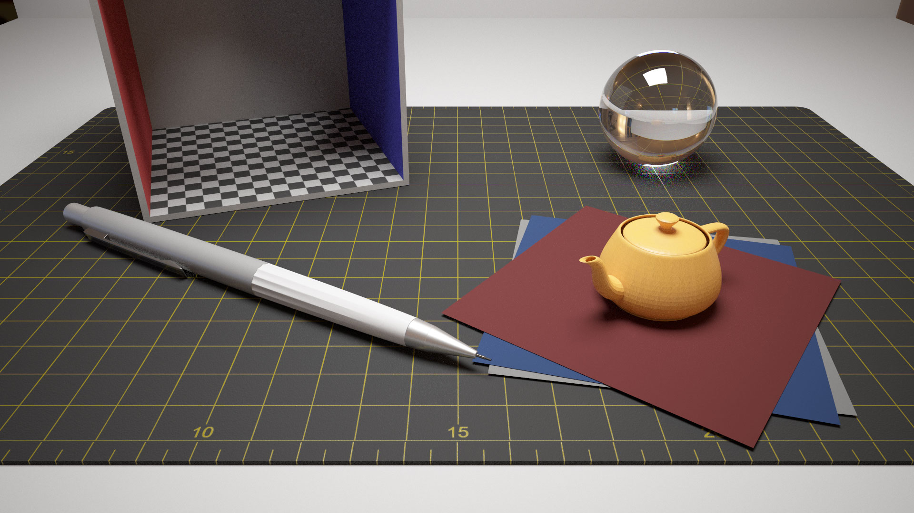
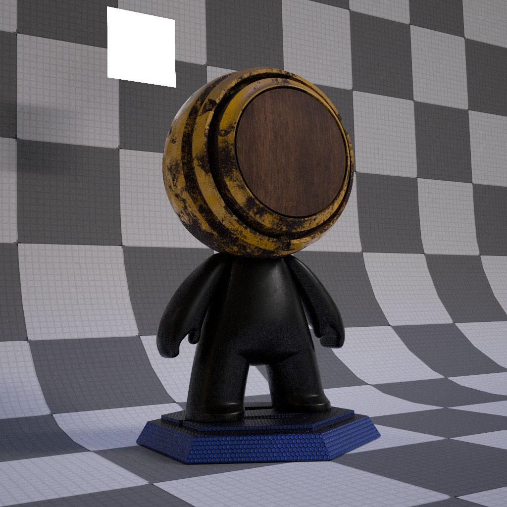
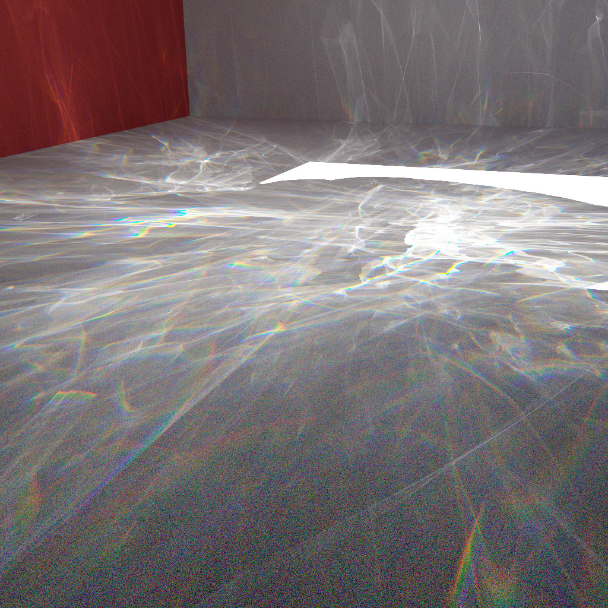
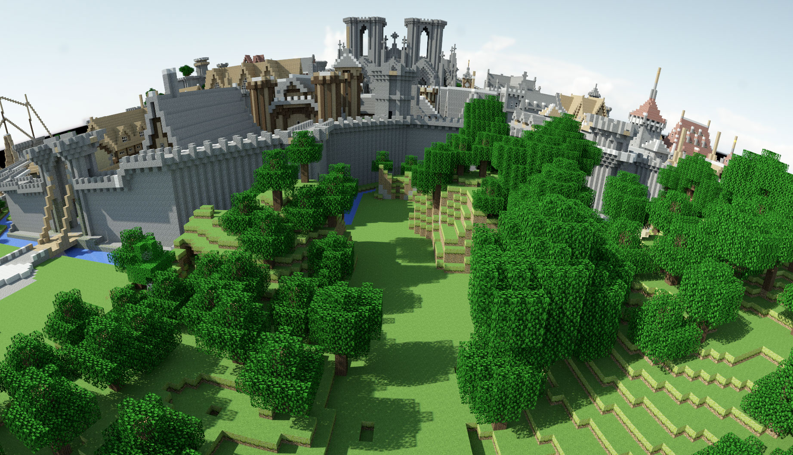

# VLR: 

\
IBL image: [sIBL Archive](http://www.hdrlabs.com/sibl/archive.html)

VLRはNVIDIA OptiX 7を使用したGPUモンテカルロレイトレーシングレンダラーです。\
VLR is a GPU Monte Carlo ray tracing renderer using NVIDIA OptiX 7.

## 特徴 / Features
* GPU Renderer using NVIDIA OptiX 7
* Full Spectral Rendering (Monte Carlo Spectral Sampling)\
  (For RGB resources, RGB->Spectrum conversion is performed using Meng-Simon's method \[Meng2015\])
* RGB Rendering (built by default)
* BSDFs
    * Ideal Diffuse (Lambert) BRDF
    * Ideal Specular BRDF/BSDF
    * Microfacet (GGX) BRDF/BSDF
    * Fresnel-blended Lambertian BSDF
    * UE4- or Frostbite-like BRDF \[Karis2013, Lagarde2014\]\
      Parameters can be specified using UE4 style (base color, roughness/metallic) or old style (diffuse, specular, glossiness).
    * Mixed BSDF
* Shader Node System
* Bump Mapping (Normal Map / Height Map)
* Alpha Texture
* Light Source Types
    * Area (Polygonal) Light
    * Point Light
    * Image Based Environmental Light
* Camera Types
    * Perspective Camera with Depth of Field (thin-lens model)
    * Environment (Equirectangular) Camera
* Geometry Instancing
* Light Transport Algorithms
    * Path Tracing \[Kajiya1986\] with MIS
    * Light Tracing
    * Light Vertex Cache Bidirectional Path Tracing (LVC-BPT) \[Davidovi&#269;2014\]
* Correct handling of non-symmetric scattering due to shading normals \[Veach1997\]

## 構成要素 / Components
* libVLR - Renderer Library based on OptiX\
  CのAPIを定義しています。\
  Exposes C API.
* vlrcpp.h - Single file wrapper for C++\
  std::shared_ptrを用いてオブジェクトの寿命管理を自動化しています。\
  Automatically manages lifetime of objects via std::shared_ptr.
* HostProgram - A program to demonstrate how to use VLR

## API
Code Example using VLRCpp (C++ wrapper)

```cpp
using namespace vlr;

ContextRef context = Context::create(cuContext, enableLogging, maxCallableDepth);

// Construct a scene by defining meshes and materials.

SceneRef scene = context->createScene();

TriangleMeshSurfaceNodeRef mesh = context->createTriangleMeshSurfaceNode("My Mesh 1");
{
    Vertex vertices[] = {
        Vertex{ Point3D(-1.5f,  0.0f, -1.5f), Normal3D(0,  1, 0), Vector3D(1,  0,  0), TexCoord2D(0.0f, 5.0f) },
        // ...
    };
    // ...
    mesh->setVertices(vertices, lengthof(vertices));

    {
        Image2DRef imgAlbedo = loadImage2D(context, "checkerboard.png", "Reflectance", "Rec709(D65) sRGB Gamma");
        Image2DRef imgNormalAlpha = loadImage2D(context, "normal_alpha.png", "NA", "Rec709(D65)");

        ShaderNodeRef nodeAlbedo = context->createShaderNode("Image2DTexture");
        nodeAlbedo->set("image", imgAlbedo);
        nodeAlbedo->set("min filter", "Nearest");
        nodeAlbedo->set("mag filter", "Nearest");

        ShaderNodeRef nodeNormalAlpha = context->createShaderNode("Image2DTexture");
        nodeNormalAlpha->set("image", imgNormalAlpha);

        // You can flexibly define a material by connecting shader nodes.
        SurfaceMaterialRef mat = context->createSurfaceMaterial("Matte");
        mat->set("albedo", nodeAlbedo->getPlug(VLRShaderNodePlugType_Spectrum, 0));

        ShaderNodeRef nodeTangent = context->createShaderNode("Tangent");
        nodeTangent->set("tangent type", "Radial Y");

        uint32_t matGroup[] = { 0, 1, 2, 0, 2, 3 };
        mesh->addMaterialGroup(matGroup, lengthof(matGroup), mat, 
                               nodeNormalAlpha->getPlug(VLRShaderNodePlugType_Normal3D, 0), // normal map
                               nodeTangent->getPlug(VLRShaderNodePlugType_Vector3D, 0), // tangent
                               nodeNormalAlpha->getPlug(VLRShaderNodePlugType_Alpha, 0)); // alpha map
    }

    // ...
}

// You can construct a scene graph with transforms
InternalNodeRef transformNode = context->createInternalNode("trf A");
transformNode->setTransform(context->createStaticTransform(scale(2.0f)));
transformNode->addChild(mesh);
scene->addChild(transformNode);

// Setup a camera
CameraRef camera = context->createCamera("Perspective");
camera->set("position", Point3D(0, 1.5f, 6.0f));
camera->set("aspect", (float)renderTargetSizeX / renderTargetSizeY);
camera->set("sensitivity", 1.0f);
camera->set("fovy", 40 * M_PI / 180);
camera->set("lens radius", 0.0f);

// Setup the output buffer (OpenGL buffer can also be attached)
context->bindOutputBuffer(1024, 1024, 0);

// Let's render the scene!
context->setScene(scene);
context->render(cuStream, camera, enableDenoiser, 1, firstFrame, &numAccumFrames);
```

## TODO
- [ ] Make the rendering properly asynchronous.
- [ ] Python Binding
- [ ] Simple Scene Editor
- [ ] Compile shader node at runtime using NVRTC to remove overhead of callable programs.

## 動作環境 / Confirmed Environment
現状以下の環境で動作を確認しています。\
I've confirmed that the program runs correctly on the following environment.

* Windows 10 (21H2) & Visual Studio 2019 (16.11.8)
* Core i9-9900K, 32GB, RTX 3080 10GB
* NVIDIA Driver 497.09

動作させるにあたっては以下のライブラリが必要です。\
It requires the following libraries.

* libVLR
    * CUDA 11.3 \
    ※CUDA 11.3.0にはバグがあり、内部で使用している[OptiX Utility](https://github.com/shocker-0x15/OptiX_Utility)と一緒に使用することができません。Update 1以降が必要です。\
    \* CUDA 11.3.0 has a bug which prevents to use it with [OptiX Utility](https://github.com/shocker-0x15/OptiX_Utility) internally used. You need to use Update 1 or later.
    * OptiX 7.4.0 (requires Maxwell or later generation NVIDIA GPU)
* Host Program
    * OpenEXR 3.1
    * assimp 5.0

## 注意 / Note
モデルデータやテクスチャーを読み込むシーンファイルがありますが、それらアセットはリポジトリには含まれていません。\
There are some scene files loading model data and textures, but those assets are NOT included in this repository.

## 参考文献 / References
[Davidovi&#269;2014] "Progressive Light Transport Simulation on the GPU: Survey and Improvements"\
[Kajiya1986] "THE RENDERING EQUATION"\
[Karis2013] "Real Shading in Unreal Engine 4"\
[Lagarde2014] "Moving Frostbite to Physically Based Rendering 3.0"\
[Meng2015] "Physically Meaningful Rendering using Tristimulus Colours"\
[Veach1997] "ROBUST MONTE CARLO METHODS FOR LIGHT TRANSPORT SIMULATION"

## ギャラリー / Gallery
<br>
A variant of the famous Cornell box scene. The left box has anisotropic BRDF with circular tangents along its local Y axis (roughness is smoother along tangent, rougher along bitangent).
<br><br>
<br>
An object with UE4- or Frostbite 3.0-like BRDF (Textures are exported from Substance Painter) illuminated by an area light and an environmental light.

Model: Substance Painter\
IBL image: [sIBL Archive](http://www.hdrlabs.com/sibl/archive.html)
<br><br>
<br>
Caustics generated from Stanford bunny model illuminated by directional area light.\
The renderer uses spectral rendering for this.

Model: [Stanford Bunny](http://graphics.stanford.edu/data/3Dscanrep/)
<br><br>
<br>
<br>
Rungholt model illuminated by outdoor environment light.

Model: Rungholt from Morgan McGuire's [Computer Graphics Archive](https://casual-effects.com/data)\
IBL image 1: [Direct HDR Capture of the Sun and Sky](https://vgl.ict.usc.edu/Data/SkyProbes/)\
IBL image 2: [sIBL Archive](http://www.hdrlabs.com/sibl/archive.html)

----
2021 [@Shocker_0x15](https://twitter.com/Shocker_0x15)
